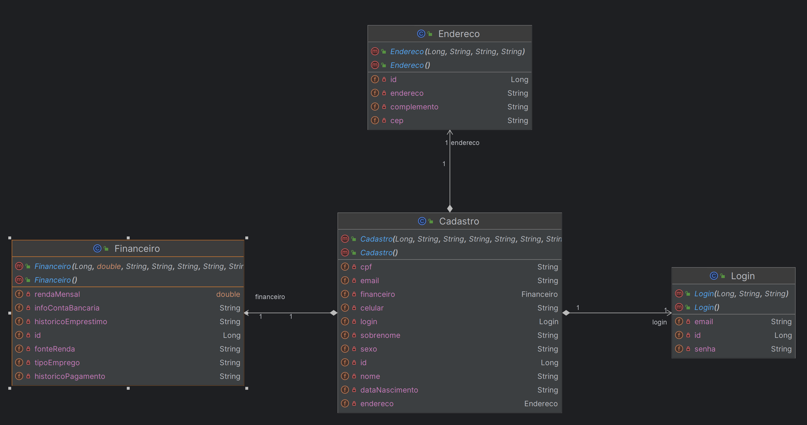
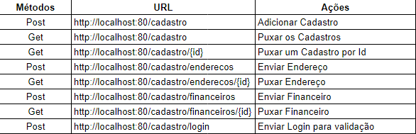

# MasterD

<h1>Nome dos integrantes e suas respectivas funções -  Data das entregas 20/05/2024</h1>
<ul>
  <li>Harthley Fernandes Teixeira Gomes -  Função -  Realizar Projeto Java e Devops tools - Foi entregue no dia 19/05/2024</li>
  <li>João Vito Santiago da Silva - Função -  Realizar DataBase e Projeto Java - Foi entregue no dia 20/05/2024</li>
  <li>Guilherme Costa Batista - Função - Realizar IOT, IA e Compliance Quality - Foi entregue no dia 20/05/2024</li>
  <li>Lucas Felix Vassiliades - Função - Realizar Mobile - Foi entregue no dia 20/05/2024</li>
  <li>Michael Bombo Leon - Função - Realizar .net (C#) - Foi entregue no dia 20/05/2024</li>
</ul>

<h1>Como faço para rodar o meu Projeto?</h1>

Abrir o IntelliJ IDEA: Se você já tem o IntelliJ instalado, abra-o. Se não, você pode baixá-lo e instalá-lo a partir do site oficial da JetBrains.

Abrir o projeto: No IntelliJ IDEA, clique em "File" (Arquivo) no menu superior e depois em "Open" (Abrir). Navegue até a pasta onde seu projeto Java está localizado e selecione a pasta do projeto.

Configurar o SDK: O IntelliJ irá pedir para configurar o SDK (kit de desenvolvimento de software) se ainda não estiver configurado. Selecione a versão do Java que você deseja usar para compilar e executar o projeto. Se o SDK não estiver instalado, você pode baixá-lo e instalá-lo através do IntelliJ.

Executar o projeto: Após abrir o projeto, localize o arquivo principal do seu programa Java (geralmente tem um método main). Clique com o botão direito do mouse neste arquivo e escolha a opção "Run" (Executar) ou "Debug" (Depurar) para executar o projeto.

Visualizar resultados: Depois de executar o projeto, você deve ver os resultados da execução no console do IntelliJ IDEA.

<h1>Diagrama</h1>

<h1>Link do vídeo Pitch</h1>

https://youtu.be/faVvlJgejws?si=c5igOGIwzMorJecz

<h1>End points</h1>

